# Dragon Flagon Architect

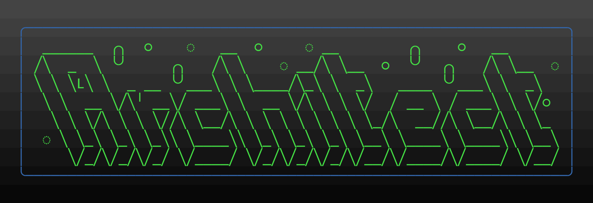


[](https://www.foundryvtt-hub.com/package/df-architect/)

Welcome to the great big Architect's Tool Suite. This module provides many many many new Quality of Life features the FoundryVTT. These are all features specifically designed to make Map Making and Scene Prep more enjoyable. I have also tried to keep it clean with a concise goal of Pre-Game prep and you should be able to safely disable this module on Game Day. Any feature that I think can be used during a game will be in one of my other many modules.

I hate big walls of text, so I've done my best to provide some images and animated previews of what each feature does. I hope you enjoy what this module brings to your FoundryVTT experience!

## Contributions
- The original featureset was Commissioned by Anathema.
- Spanish Localization - Courtesy of [lozalojo](https://github.com/lozalojo)
- Wall Gap Feature - Referenced the excellent macro created by [itamarcu](https://github.com/itamarcu)

---

**[](https://www.patreon.com/bePatron?u=46113583) If you want to support me or just help me buy doggy treats! Also, you can keep up to date on what I'm working on with regular posts! I will be announcing any new modules or pre-releases there for anyone wanting to help me test things out!**

---

## Dependencies

- [libWrapper](https://foundryvtt.com/packages/lib-wrapper) This is used where ever DF Architect needs to patch FoundryVTT Core functionality. This helps it play nicer with other modules and avoid conflicts.
- [lib - ColorSettings](https://foundryvtt.com/packages/colorsettings) This module makes colour selections in the FoundryVTT modules settings much easier for you.

## Contents

* [General Features](#general-features)
  * [See Walls/Lights/Sounds on other Layers](#See-WallsLightsSounds-on-other-Layers)
  * [Layer Object Counters](#Layer-Object-Counters)
  * [Quick Colour Picker](#quick-colour-picker)
    - [For Devs: You can use this feature!](#for-devs-you-can-use-this-feature)
  * [Alternate Grid Snap](#alternate-grid-snap)
  * [Layer Hotkeys](#layer-hotkeys)
  * [Layer Quick Swap](#layer-quick-swap)
  * [Canvas Capture](#canvas-capture)
    * [Image Saving](#Image-Saving)
    * [Hidden Tokens, Tiles, Drawings](#hidden-tokens-tiles-drawings)
    * [Capture Current View](#capture-current-view)
    * [Capture Whole Canvas](#capture-whole-canvas)
    * [Capture Whole Canvas with Padding](#capture-whole-canvas-with-padding)
    * [Capture Vision](#capture-vision)
    * [Layer Filtering (GM Only)](#layer-filtering-gm-only)
    * [Public Canvas Capture API](#Public-Canvas-Capture-API)
    	* [API Definitions](#API-Definitions)
* [Tiles Features](#Tiles-Features)
	* [Tile Flattener](#Tile-Flattener)
		* [Tile Flatten Config](#Tile-Flatten-Config)
		* [Save Image Dialog](#Save-Image-Dialog)
		* [Save to Server Additional Options](#Save-to-Server-Additional-Options)
	* [Tile Config Improvements](#Tile-Config-Improvements)
* [Walls Features](#walls-features-1)
	+ [Lock Wall Chaining](#lock-wall-chaining)
	+ [Auto-Snap Wall Endpoint](#auto-snap-wall-endpoint)
	+ [Wall Direction Labels and Orientation Swap](#wall-direction-labels-and-orientation-swap)
	+ [Wall Type Hotkey](#wall-type-hotkey)
	+ [Wall Type Switching](#wall-type-switching)
	+ [Wall Splitting](#wall-splitting)
	+ [Wall Joining](#wall-joining)
* [Lighting Features](#lighting-features-1)
	+ [Show Light Origin](#show-light-origin)
	+ [Hold Alt for Darkness (Negative Light Radius)](#hold-alt-for-darkness-negative-light-radius)
	+ [Light Templating](#light-templating)
		- [Standard Light Templates](#standard-light-templates)

## General Features

These are some of the general features that are available outside of the Game Board layers

### See Walls/Lights/Sounds on other Layers

The walls, lighting, and wounds layers now have a toggle button that allows you to see them from other layers. This is very handy for map building when you are placing lights and such and want to try and line things up, or see exactly what walls/lights/sounds you're interacting with. When this feature is active on the wall/light/sound, the icon for that layer will slowly flash blue to indicate that this is turned on.


### Layer Object Counters

The Tiles, Walls, Lights, and Sounds layers will now each display an Object Counter to the left of the sidebar that displays how many objects are on that layer. You can also hover the counter for more info.

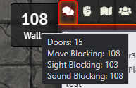

### Quick Colour Picker

You can now use an eyedropper from any FoundryVTT Config dialog that has a colour selector to quickly select a colour from the current map. Great for trying to match a light colour to a material in the map like lava, water, etc. This will immediately minimize ALL open windows during the selection process. It will then restore all windows that were not previously minimized.

**You can Cancel the Colour Picker with a single `Right + Click`**

#### For Devs: You can use this feature!

The eye dropper tool is available globally and can be used via this function

```typescript
await EyeDropper.getColor(app?: Application)
```

The `app` parameter is optional, and is just used as an easy way to have the eye dropper automatically refocus your application after it has completed its task of minimizing/maximizing all windows.


### Alternate Grid Snap

Grid snapping can be toggled to snap to box centers instead of intersections. This is useful for placing walls or similar in-between the usual snap points without having to hold `Shift` and avoid not getting the walls ends lined up right.


### Layer Hotkeys

Layers are now mapped to keyboard shortcuts for quick switching. This is fully customizable in the module's settings.

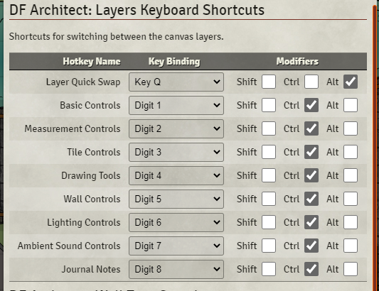

### Layer Quick Swap

Two layers can be mapped to a hotkey that will quickly switch back and forth between them when pressed. For example, when you're working on walls and lighting, and want to quickly switch back and forth between those two layers.

### Canvas Capture

You can now capture the current scene's canvas. Kind of like a screenshot, but it will render either the currently visible portion of the canvas visible in the browser window, or it will render the entire canvas. You can also hide individual layers from the rendered image. This is perfect for removing all lighting, weather, tokens, tiles, drawings, etc. without having to change anything to the gameboard itself. The canvas capture dialog will give you a Live Preview of this filtering in action. You can also have Walls, Light Sources, Sound Sources get rendered as if you were on those layers.

#### Image Saving

As of v3.0, Images are now saved using a Save Image prompt that provides a preview of the result and the option to save either on your local computer or the server.

**Known Conflicts:** The **Tile Flattener** feature does not work properly with the **Levels** module. It does a lot of management of objects in a way that I am unable to interact with. If there are tokens or objects showing up in your final image, you will have to disable **Levels** to get an accurate image capture.

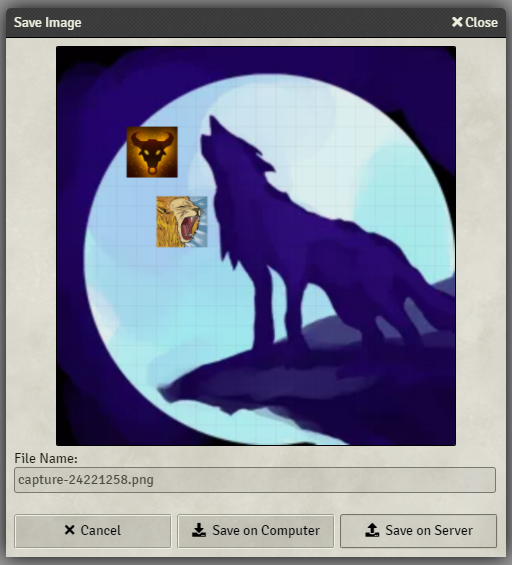

#### Hidden Tokens, Tiles, Drawings

Tokens, Tiles, and Drawings can be made "hidden" in FoundryVTT. By default, Canvas Capture will completely remove these items from the rendering. There is, however, an option to Show Hidden for each individual layer. This will render the hidden Tokens, Tiles, or Drawings to the final image.

#### Capture Current View

|Demo|Result|
|:-:|:-:|
|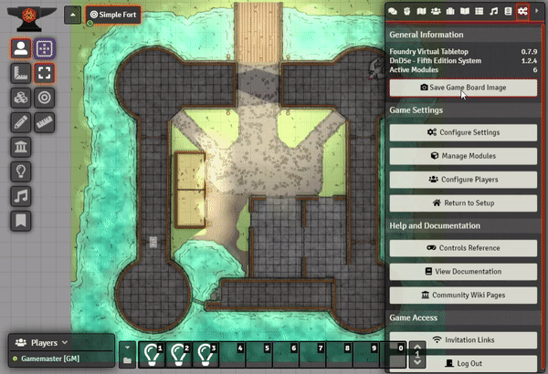||

#### Capture Whole Canvas

|Demo|Result|
|:-:|:-:|
|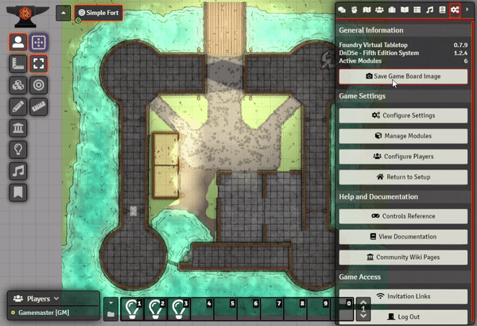|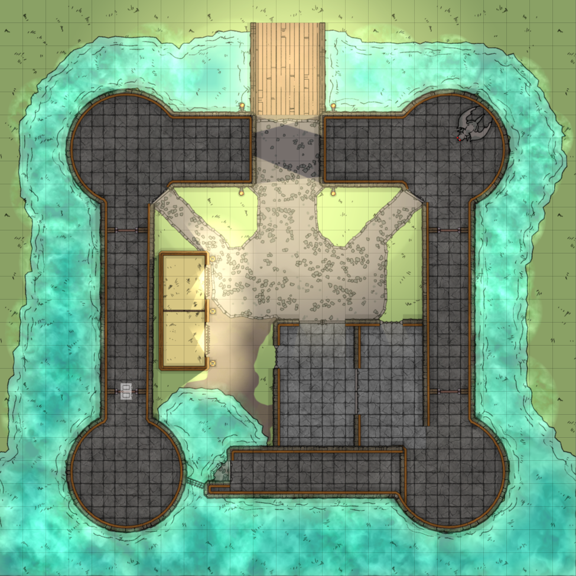|

#### Capture Whole Canvas with Padding

|Demo|Result|
|:-:|:-:|
||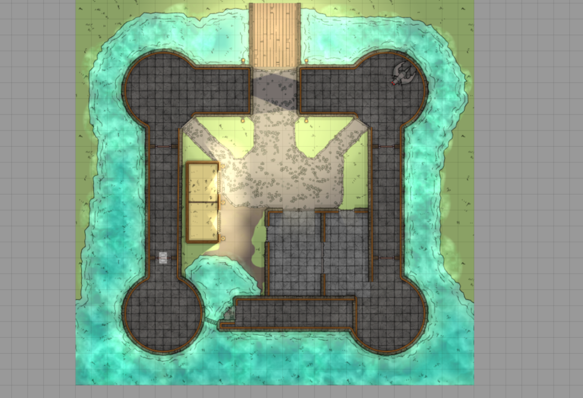|

#### Capture Vision

You can easily capture token vision by simply selecting the tokens you want to render the vision for. The black vision mask will be rendered out to the final image. You can also toggle the "Sight Layer" in the [Layer Filters](#Layer-Filtering-GM-Only) demoed below, which will remove the vision occlusion layer.

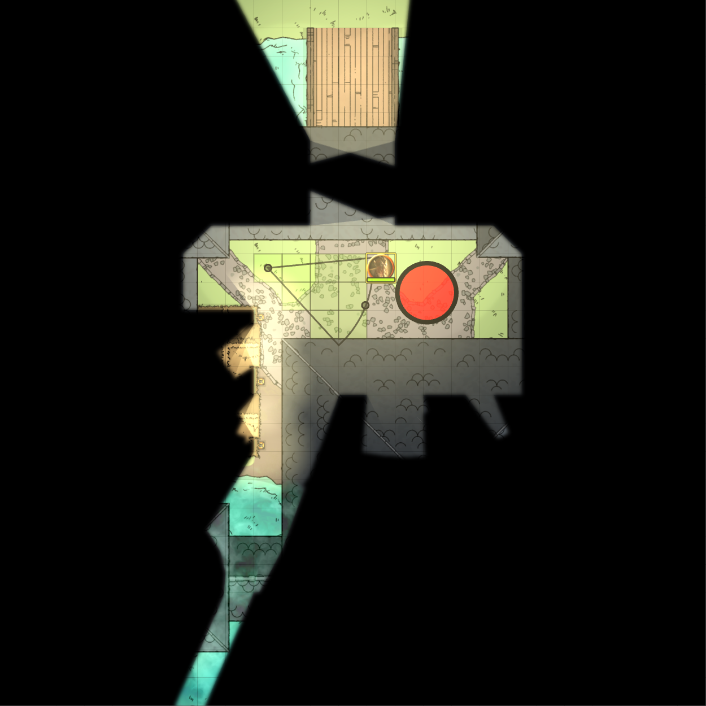

#### Layer Filtering (GM Only)

This is a very complex feature that allows you to do some really awesome layer filtering. Don't want to show tiles? No problem, just uncheck that layer. You can also show the "controls" for certain layers, such as showing the walls, light icons, and sound icons that normally only show when you're on those layers.

Also, when you have Hidden Tokens/Tiles/Drawings, those will be default not be rendered. In here you can enable "Show Hidden" for the specific layers that have hideable objects. This will then render those items to the final image at a full opacity (not the half transparent they're usually like).

**All changes made here will be automatically reverted after the Save Gameboard dialog closes**

|Demo|Result|
|:-:|:-:|
||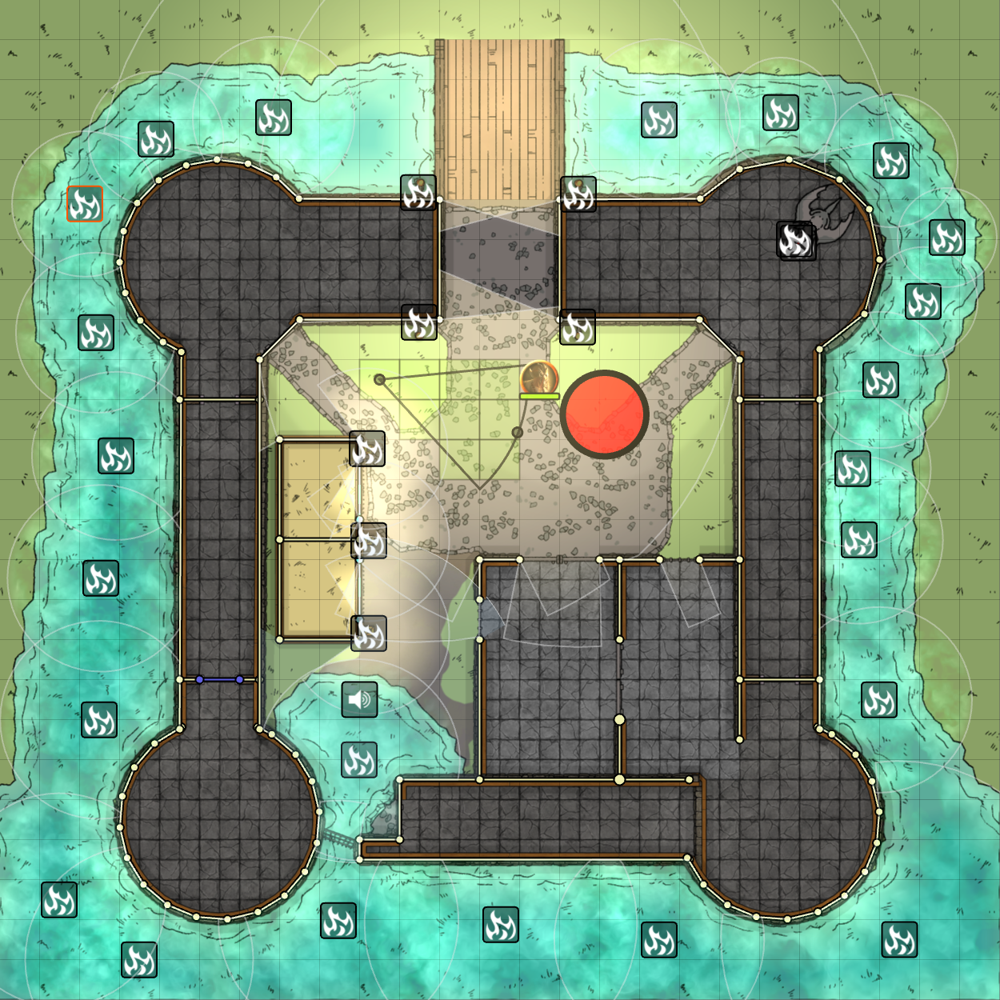|

#### Public Canvas Capture API

Macro and Module developer can now access the `CanvasCapture` processor. You simply follow some specific steps and you can capture any portion/zoom of the canvas. A working example can be found below:

```JavaScript
async function CaptureCanvas() {
	const session = CanvasCapture.beginCapture(false);
	if (!session) {
		// A session is already running...
		return;
	}
	// Hide the Token Layer from render
	CanvasCapture.toggleLayer("TokenLayer", false);
	// Render the Hidden Tiles
	CanvasCapture.toggleHidden("BackgroundLayer", true);
	// Show the light icons and boundries
	CanvasCapture.toggleControls("LightingLayer", true);
	// Render the final image
	const imageData = CanvasCapture.render({
		format: "image/jpeg", // Supports jpeg, png, and (chromium only)webp
		quality: 0.9,
		view: {
			x: 100, y: 100,
			w: 400, h: 400,
			s: 1.0
		}
	});
	CanvasCapture.endCapture(session);
	const filePath = await CanvasCapture.saveImageData({image: imageData});
	if (filePath !== null) {
		// User selected to save on the server
	} else {
		// Use the server image path...
	}
}
```

##### API Definitions

```TypeScript
// Contains a complete image capture result
interface ImageData {
	// Base64 Data URI
	data: string;
	// Width of image
	width: number;
	// Height of image
	height: number;
}

class CanvasCapture {
	// Known layers with Invisible Placeables (ie. Lights, Sounds, and Walls)
	static readonly LayersWithInvisiblePlaceables;
	// Known layers with Hideable entities (ie. Tiles, Tokens, and Drawings)
	static readonly LayersWithHiddenPlaceables;
	/**
	 * Begins the process of capturing the canvas.
	 * @param throwOnError If true, an error is thrown if a Capture is already running; otherwise function will return null.
	 * @returns The HiddenPlaceablesSnapshot
	 * @throws If `beginCapture()` has been invoked and `endCapture()` has not been subsequently invoked yet.
	 */
	static beginCapture(throwOnError: boolean = true): CaptureSession;
    /**
	 * Ends a capture session. Resetting all changes to layers and objects.
	 * @param session The {@link CaptureSession} object returned by {@link beginCapture}
	 * @returns 
	 */
	static endCapture(session: CaptureSession): boolean;
	/**
	 * Renders the Canvas to a single image.
	 * @param format MIME type of final image. Supports `image/png`, `image/jpeg`, (Chromium only) `image/webp`.
	 * @param quality The percent quality from 0 to 1 for Jpeg and WebP images.
	 * @param keepPadding (optional) Includes the canvas padding if no {@link view} is given.
	 * @param view The region of the canvas and scale to render.
	 * @returns {@link ImageData} object containing the rendered image
	 */
	static async render({ format: string, quality: number, keepPadding?: boolean, view?: { x: number, y: number, w: number, h: number, s: number } }): Promise<ImageData>;
	/**
	 * Toggle the visibility of the given layer.
	 * @param layerName String name of the layer to shown/hidden.
	 * @param show true to show; false to hide.
	 */
	static toggleLayer(layerName: string, show: boolean);
	/**
	 * Toggle the visibility of hidden entities on the given layer.
	 * @param layerName String name of the layer to show/hide entities on.
	 * @param show true to show; false to hide.
	 */
	static toggleHidden(layerName: string, show: boolean);
	/**
	 * Toggle the visibility of entity controls on the given layer.
	 * @param layerName String name of the layer to show/hide entity controls on.
	 * @param show true to show; false to hide.
	 */
	static toggleControls(layerName: string, show: boolean);
	/**
	 * Prompt the user to save the image data to either their computer or the server.
	 * @param image {@link ImageData} object to be saved.
	 * @param dialogTitle (optional) Title to display in the Dialog Titlebar.
	 * @param defaultFileName (optional) Default file name to be used as a placeholder. Default: 'capture'
	 * @param folder (optional) Folder path to save the image to (must already exist).
	 * @param folderSource (optional) Storage source for saving the file (ie. 'data', 'public', or 's3')
	 * @param allowDownload (optional) If true, allow the user to download the image to their computer; otherwise the option will be hidden.
	 * @returns String containing the server file path to the image is uploaded; otherwise null if the user saved locally, or undefined if the user cancelled the process.
	 */
	static async saveImageData({ image: ImageData, dialogTitle: string, defaultFileName: string, folder: string, folderSource: string, allowDownload: boolean }): Promise<string>;
}
```

## Tiles Features

### Tile Flattener

This feature utilises the Canvas Capture API to provide a quick and easy process for flattening a map of tiles into a single image for optimising a scene and reduce load times and increase performance. After capturing the tiles, you can then either download the image, or upload it to the server. If you upload it to the server, you will also be presented with additional options of what to do with the image.

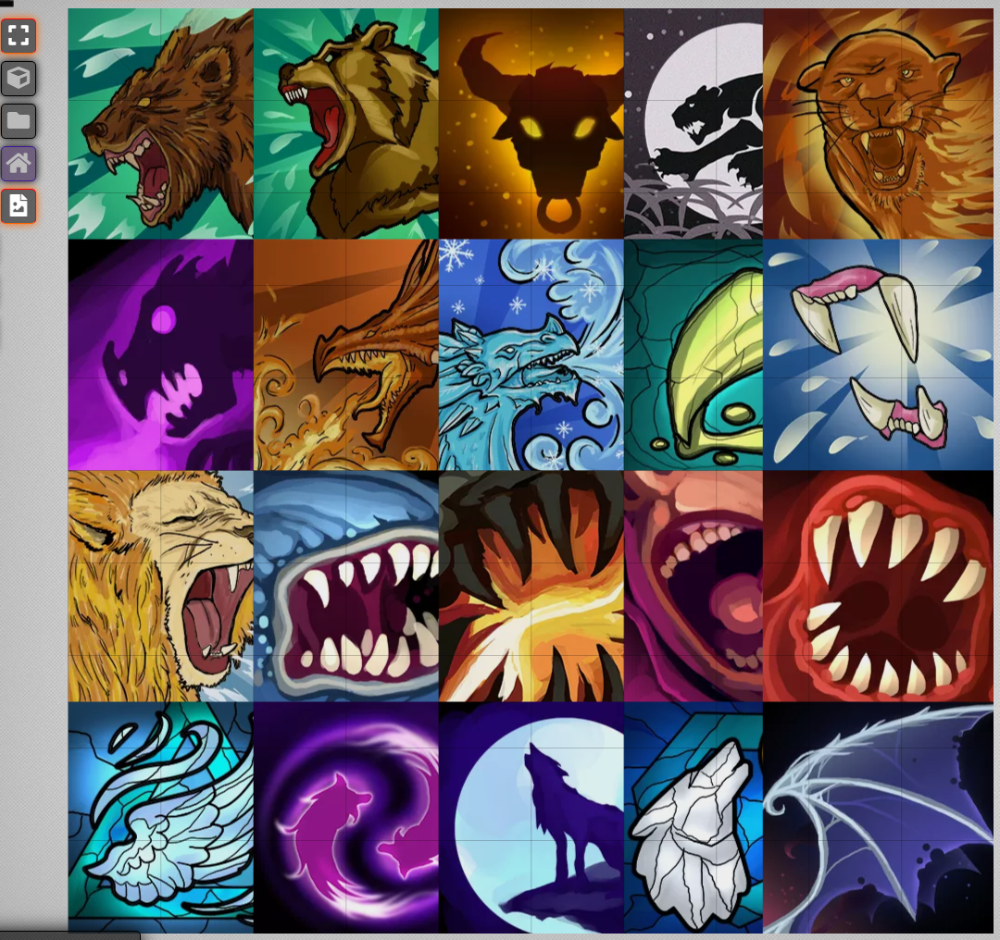

#### Tile Flatten Config


| Option               | Description                                                  |
| -------------------- | ------------------------------------------------------------ |
| Render&nbsp;Lighting | If enabled, the lighting layer will be rendered above the tiles. Great for baking lighting into a night map if you want to remove the lights for a more performant map. |
| Render&nbsp;Background&nbsp;Image | If disabled, the scene's background image will be hidden. If you want to create a set of tiles that sit on a transparent background, disabling this will allow you to do that. |
| Render&nbsp;Hidden&nbsp;Tiles  | If enabled, hidden tiles will get rendered to the final image. This is only relevant if you have the "Entire Canvas" option selected. |
| Entire&nbsp;Canvas        | Renders the entire canvas and all of the background and roof tiles (not including scene padding) to the final image |
| Selected&nbsp;Tiles       | Will only render the tiles that are currently selected, including selected hidden tiles. The final image will be cropped to the area the selected tiles are in. |
| Padding              | (Selected Tiles Option Only) Adds additional pixels of padding around the selected tiles. Useful for including more of the background image, or adding some extra spacing along the border. |
| File Format | Supported file types:<br />- PNG<br />- JPEG<br />-WebP (Chromium browsers only) |
| Quality | The compression quality for JPEG and WebP images. |

#### Save Image Dialog

After clicking the <kbd>Flatten Tiles</kbd> button, you will be prompted with a dialog containing a preview of the final image and the options to save to your local computer, or to the FoundryVTT Server. The location on the server is configurable in the Module Settings.

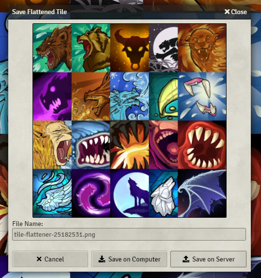

#### Save to Server Additional Options

If You select the <kbd>Save on Server</kbd> option, you will be given an additional prompt after saving that allows you to do some automated processes.

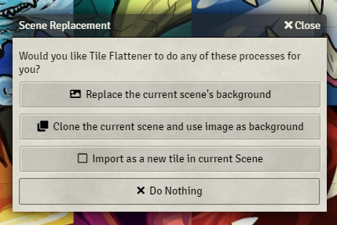

| Options                                                      | Description                                                  |
| ------------------------------------------------------------ | ------------------------------------------------------------ |
| <kbd>Replace the current scene's background</kbd>            | The current scene's background will be changed to the newly created image. |
| <kbd>Clone the current scene and use the image as background</kbd> | Clones the current scene and its content and sets the new scene's background to the newly created image. |
| <kbd>Import as a new tile in current Scene</kbd>             | Import the new image as a tile into the center of the current scene. |

### Tile Config Improvements

The Tile Config will now show a thumbnail of the tile image selected. This will automatically update if you change the Tile Image field. To the right there will also be a description of the image's dimensions and aspect ratio.

There are now two new buttons to the right of the Width and Height fields. The Width field will scale the width based on the original image's aspect ratio to be relative to the set height. The same occurs for the height scale button but in relation to the set width.


## Walls Features

### Lock Wall Chaining

When placing walls, you can toggle this option (either with the new "Lock Wall Chaining" button or `Alt + C` hotkey). This will make wall chaining occur without having to hold down the Ctrl key. Instead you hold the Ctrl key to start a new wall without chaining. This is a simple addition to help alleviate stress on your finger that normally has to hold that Ctrl key down when doing a long wall chain.

### Auto-Snap Wall Endpoint

You can now hold the `Alt` key while dragging a wall endpoint to display a circle around the point. When you drop the endpoint with the `Alt` key still pressed, the endpoint will automatically snap to the nearest wall that has an end inside the circle. This is great for dealing with walls that are not grid aligned.

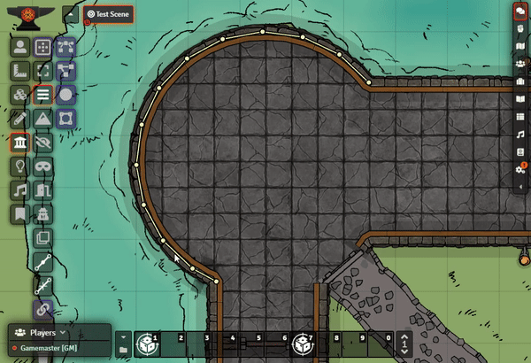

### Wall Direction Labels and Orientation Swap

Selected walls will now display a "L" and "R" on the Left and Right sides of the wall. This helps with selecting a Wall Direction so you can know at a glance what orientation the wall is in. Before, you would have to randomly select a direction and then check if it was correct. If it wasn't, you had to reopen the wall config and switch it.

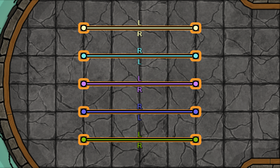

You can also `Double Right-Click` the node of a Selected wall to reverse the direction of that wall. This is useful if you have a long chain of walls that are all one direction, but there is a a couple walls in the chain that are opposite. If a wall already has a direction set, instead of inverting the orientation of the wall, double right clicking will simply switch the set direction.

There is also a setting that, if enabled, will allow you to quickly invert the orientation of a wall without having to select it first. This is not default so as to help prevent accidental wall inversions by stray double right clicks.

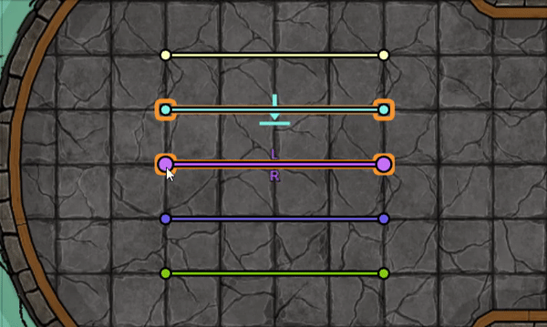

### Wall Type Hotkey

There are now hotkeys for quickly switching to the different wall types. If you switch a wall type with a hotkey while in the middle of creating a new wall, it will also update that wall to the new type.

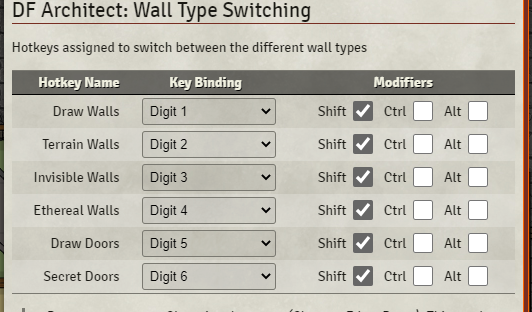

### Wall Force Snap to Grid Hotkey and Patch

There is also now a hotkey defined for toggling FoundryVTT's "Force Snap to Grid" feature. Also, this feature has been patched so that holding shift will properly ignore grid snapping when this feature is on.

### Wall Type Switching

While walls are selected, you can quickly switch their type by holding the `Ctrl` key down while clicking the wall type you want in the scene controls. The below demo shows the types being switched by holding Ctrl while clicking the buttons.

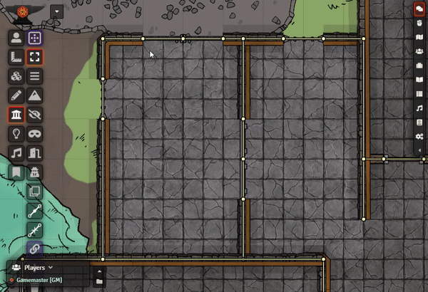

### Wall Splitting

Each selected wall segment will be divided into 2 wall segments. This can be very useful in conjunction with modules like the [Multiple Wall Point Mover (MWPM)](https://foundryvtt.com/packages/mwpm) module to quickly split a wall in two and move that joint to another place on the map.

### Wall Joining

The selected contiguous wall segments will be joined into a single wall. Useful when you have a couple of chained walls that really could just be one.

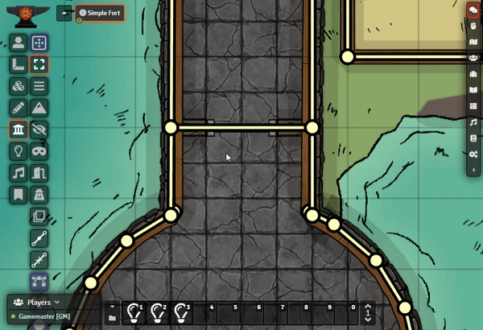

### Wall Gap Fill

Sometimes when placing walls, the joints between them may not be perfectly aligned. When this happens you can see sight artifacts as tokens will be able to see through the small gap. These gaps can be very difficult to spot, so this feature will automatically detect all wall endpoints that have a gap less than a customizable distance. It will then mark those gaps with a green circle, and ask if you would like to close them. If you click yes, it will go through and close all of the detected gaps by moving them to the average midpoint between them.

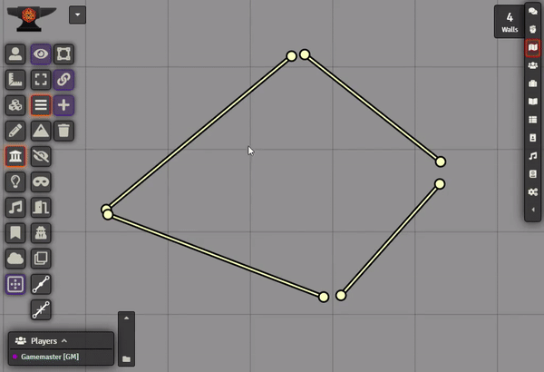

## Lighting Features

### Show Light Origin

If you are trying to perfectly place a light source, you're going to typically hold the Shift key to avoid snapping to the grid. Now when you hold the Shift key, the Light Source token will be replaced with a set of Crosshairs that point to the exact origin of the light source. By default the crosshairs are White, but if you also hold the Alt key, they will change to Orange (in case the white is difficult to see on your current map).

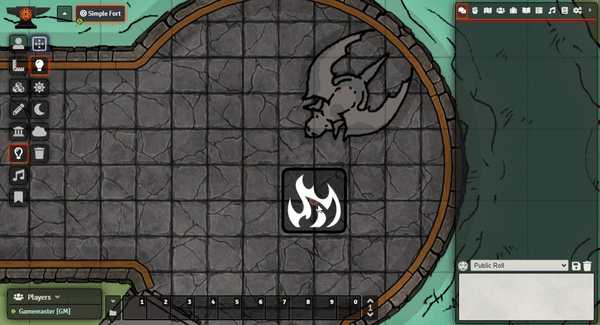

### Hold Alt for Darkness (Negative Light Luminosity)

If you hold the `Alt` key while dragging out a new light, it will use a negative luminosity instead and create a patch of darkness. You will also find a button in the Light Config for quickly inverting a light's luminosity between positive and negative (Light / Dark).

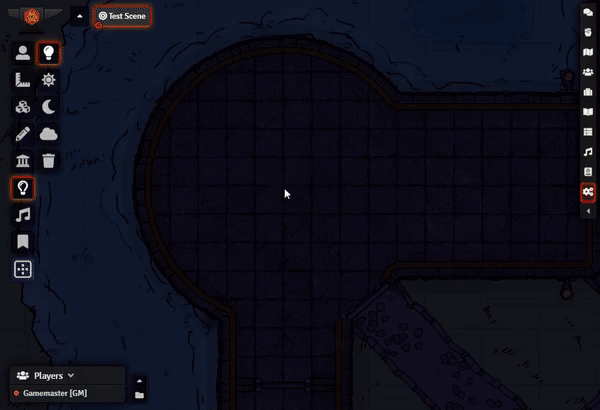

### Light Templating

Saving and sharing of light templates. You want to place a D&D 5e torch, you can just save the light source as a template to be placed onto the lighting layer at any time.

Light templates are stored in your Macros and can be easily placed onto the Hotbar at the bottom of the screen. Clicking the macro will automatically switch you to the Lighting Layer and activate that template (indicated by the dialog that appears on the left of the screen). This dialog displays the current configuration of the light template, and also has Edit and Cancel buttons for editing the current template, or clearing the current template selection.

When a template is selected, you can `LeftClick + Drag` like normal to place a light using all of the settings, except the Dim/Bright range (as that is determined by how far you drag with your mouse). Alternatively you can `Ctrl + LeftClick` to place a light on your mouse pointer's current position. This will use all the configured settings, including the Dim/Bright range specified in the template.

You can also cancel the current template by either clicking the `X` on the template window, or `Ctrl + RightClick` anywhere on the gameboard.

|Creating a Template from an existing Light Source|Duplicating and changing an existing Template|
| :-: | :-: |
|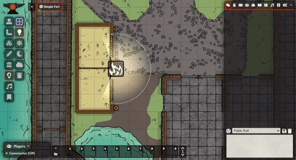|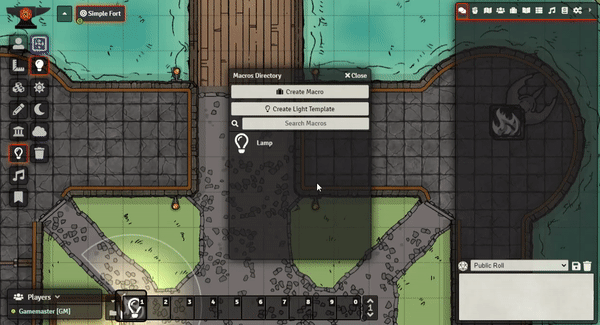|

| Using a template by Click+Dragging to set range |
| :---------------------------------------------: |
||

#### Standard Light Templates

A compendium of common light templates for D&D 5e, and Pathfinder 1e & 2e. (For PF1e&2e, not pictured are the Sunrods as well, which are alphabetically at the bottom of the list).

These templates are both standard lights with pre-set Dim/Bright Ranges based on the respective rule systems. They also come with secondary pre-animated macros if you want a starting point. You can just import the macros and then edit them however you'd like (Such as adding tint colours).

|D&D 5e Light Templates|Pathfinder 1e Light Templates|Pathfinder 2e Light Templates|
|:-:|:-:|:-:|
|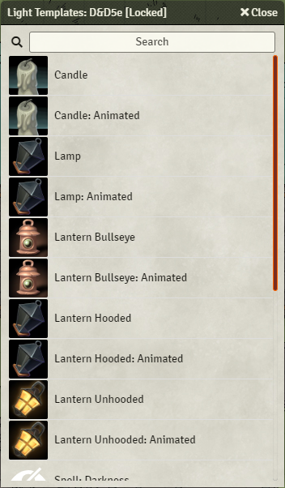|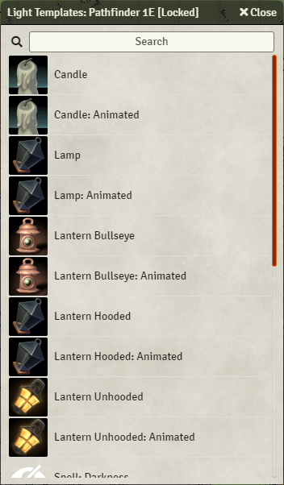|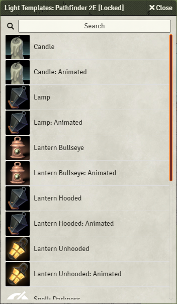|
