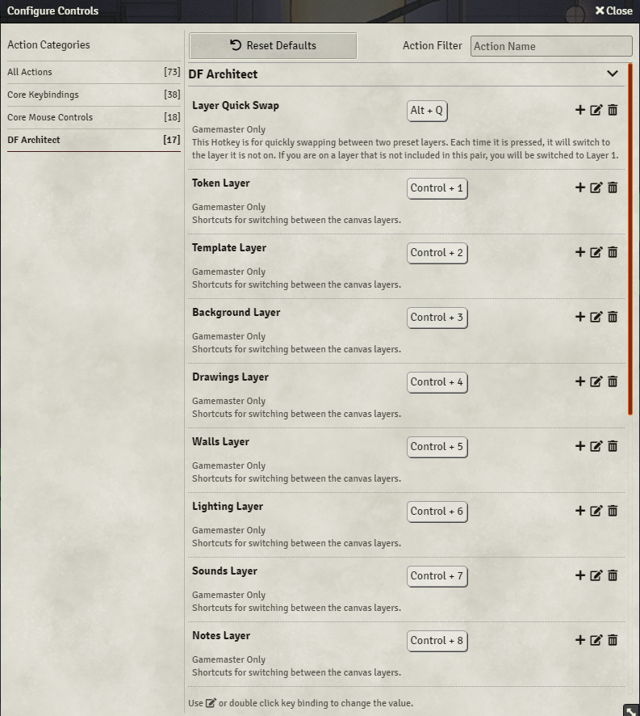

# Dragon Flagon Architect


Welcome to the great big Architect's Tool Suite. This module provides many many many new Quality of Life features to the Foundry Walls and Lighting layers. As well as a few extras that are just fun to have and make life a little easier.

I hate big walls of text, so I've done my best to provide some animated previews of what each feature does. I hope you enjoy what this module brings to your FoundryVTT experience!

## Contributions
- This module was Commissioned by Anathema.
- Spanish Localization - Courtesy of [lozalojo](https://github.com/lozalojo)

---

**[](https://www.patreon.com/bePatron?u=46113583) If you want to support me or just help me buy doggy treats! Also, you can keep up to date on what I'm working on with regular posts! I will be announcing any new modules or pre-releases there for anyone wanting to help me test things out!**

---

## Dependencies

- [Library: DF Hotkeys](https://foundryvtt.com/packages/lib-df-hotkeys/) This is used for all the key bindings for various actions.
- [libWrapper](https://foundryvtt.com/packages/lib-wrapper) This is used where ever DF Architect needs to patch FoundryVTT Core functionality. This helps it play nicer with other modules and avoid conflicts.
- [lib - ColorSettings](https://foundryvtt.com/packages/colorsettings) This module makes colour selections in the FoundryVTT modules settings much easier for you.


## General Features

These are some of the general features that are available outside of the Game Board layers

### Quick Colour Picker

You can now use an eyedropper from any FoundryVTT Config dialog that has a colour selector to quickly select a colour from the current map. Great for trying to match a light colour to a material in the map like lava, water, etc. This will immediately minimize ALL open windows during the selection process. It will then restore all windows that were not previously minimized.

**You can Cancel the Colour Picker with a single `Right + Click`**

#### For Devs: You can use this feature!

The eye dropper tool is available globally and can be used via this function

```typescript
await EyeDropper.getColor(app?: Application)
```

The `app` parameter is optional, and is just used as an easy way to have the eye dropper automatically refocus your application after it has completed its task of minimizing/maximizing all windows.


### Alternate Grid Snap

Grid snapping can be toggled to snap to box centers instead of intersections. This is useful for placing walls or similar in-between the usual snap points without having to hold `Shift` and avoid not getting the walls ends lined up right.


### Layer Hotkeys

Layers are now mapped to keyboard shortcuts for quick switching. This is fully customizable in the module's settings.


### Layer Quick Swap

Two layers can be mapped to a hotkey that will quickly switch back and forth between them when pressed. For example, when you're working on walls and lighting, and want to quickly switch back and forth between those two layers.

### Canvas Capture

You can now capture the current scene's canvas. Kind of like a screenshot, but it will render either the currently visible portion of the canvas visible in the browser window, or it will render the entire canvas. You can also hide individual layers from the rendered image. This is perfect for removing all lighting, weather, tokens, tiles, drawings, etc. without having to change anything to the gameboard itself. The canvas capture dialog will give you a Live Preview of this filtering in action. You can also have Walls, Light Sources, Sound Sources get rendered as if you were on those layers.

#### Hidden Tokens, Tiles, Drawings

Tokens, Tiles, and Drawings can be made "hidden" in FoundryVTT. By default, Canvas Capture will completely remove these items from the rendering. There is, however, an option to Show Hidden for each individual layer. This will render the hidden Tokens, Tiles, or Drawings to the final image.

#### Capture Current View Demo

|Demo|Result|
|:-:|:-:|
|||

#### Capture Whole Canvas

|Demo|Result|
|:-:|:-:|
|||

#### Capture Whole Canvas with Padding

|Demo|Result|
|:-:|:-:|
|||

#### Capture Vision

You can easily capture token vision by simply selecting the tokens you want to render the vision for. The black vision mask will be rendered out to the final image. You can also toggle the "Sight Layer" in the [Layer Filters](#Layer-Filtering-GM-Only) demoed below, which will remove the vision occlusion layer.


#### Layer Filtering (GM Only)

This is a very complex feature that allows you to do some really awesome layer filtering. Don't want to show tiles? No problem, just uncheck that layer. You can also show the "controls" for certain layers, such as showing the walls, light icons, and sound icons that normally only show when you're on those layers.

Also, when you have Hidden Tokens/Tiles/Drawings, those will be default not be rendered. In here you can enable "Show Hidden" for the specific layers that have hideable objects. This will then render those items to the final image at a full opacity (not the half transparent they're usually like).

**All changes made here will be automatically reverted after the Save Gameboard dialog closes**

|Demo|Result|
|:-:|:-:|
|||


## Walls Features

### Lock Wall Chaining

When placing walls, you can toggle this option (either with the new "Lock Wall Chaining" button or `Alt + C` hotkey). This will make wall chaining occur without having to hold down the Ctrl key. Instead you hold the Ctrl key to start a new wall without chaining. This is a simple addition to help alleviate stress on your finger that normally has to hold that Ctrl key down when doing a long wall chain.

### Auto-Snap Wall Endpoint

You can now hold the `Alt` key while dragging a wall endpoint to display a circle around the point. When you drop the endpoint with the `Alt` key still pressed, the endpoint will automatically snap to the nearest wall that has an end inside the circle. This is great for dealing with walls that are not grid aligned.


### Wall Direction Labels and Orientation Swap

Selected walls will now display a "L" and "R" on the Left and Right sides of the wall. This helps with selecting a Wall Direction so you can know at a glance what orientation the wall is in. Before, you would have to randomly select a direction and then check if it was correct. If it wasn't, you had to reopen the wall config and switch it.


You can also `Double Right-Click` the node of a Selected wall to reverse the direction of that wall. This is useful if you have a long chain of walls that are all one direction, but there is a a couple walls in the chain that are opposite. If a wall already has a direction set, instead of inverting the orientation of the wall, double right clicking will simply switch the set direction.

There is also a setting that, if enabled, will allow you to quickly invert the orientation of a wall without having to select it first. This is not default so as to help prevent accidental wall inversions by stray double right clicks.


### Wall Type Hotkey

There now hotkeys for quickly switching to the different wall types.



### Wall Splitting

Each selected wall segment will be divided into 2 wall segments. This can be very useful in conjunction with modules like the [Multiple Wall Point Mover (MWPM)](https://foundryvtt.com/packages/mwpm) module to quickly split a wall in two and move that joint to another place on the map.

### Wall Joining

The selected contiguous wall segments will be joined into a single wall. Useful when you have a couple of chained walls that really could just be one.


## Lighting Features

### Show Light Origin

If you are trying to perfectly place a light source, you're going to typically hold the Shift key to avoid snapping to the grid. Now when you hold the Shift key, the Light Source token will be replaced with a set of Crosshairs that point to the exact origin of the light source. By default the crosshairs are White, but if you also hold the Alt key, they will change to Orange (in case the white is difficult to see on your current map).


### Hold Alt for Darkness (Negative Light Radius)

If you hold the `Alt` key while dragging out a new light, it will use a negative radius instead and create a patch of darkness. You will also find a button in the Light Config for quickly switching a light's radius between positive and negative (Light / Dark).


### Light Templating

Saving and sharing of light templates. You want to place a D&D 5e torch, you can just save the light source as a template to be placed onto the lighting layer at any time.

Light templates are stored in your Macros and can be easily placed onto the Hotbar at the bottom of the screen. Clicking the macro will automatically switch you to the Lighting Layer and activate that template (indicated by the dialog that appears on the left of the screen). This dialog displays the current configuration of the light template, and also has Edit and Cancel buttons for editing the current template, or clearing the current template selection.

When a template is selected, you can `LeftClick + Drag` like normal to place a light using all of the settings, except the Dim/Bright range (as that is determined by how far you drag with your mouse). Alternatively you can `Ctrl + LeftClick` to place a light on your mouse pointer's current position. This will use all the configured settings, including the Dim/Bright range specified in the template.

You can also cancel the current template by either clicking the `X` on the template window, or `Ctrl + RightClick` anywhere on the gameboard.

|Creating a Template from an existing Light Source|Duplicating and changing an existing Template|
| :-: | :-: |
|||

| Using a template by Click+Dragging to set range |
| :---------------------------------------------: |
||

#### Standard Light Templates

A compendium of common light templates for D&D 5e, and Pathfinder 1e & 2e. (For PF1e&2e, not pictured are the Sunrods as well, which are alphabetically at the bottom of the list).

These templates are both standard lights with pre-set Dim/Bright Ranges based on the respective rule systems. They also come with secondary pre-animated macros if you want a starting point. You can just import the macros and then edit them however you'd like (Such as adding tint colours).

|D&D 5e Light Templates|Pathfinder 1e Light Templates|Pathfinder 2e Light Templates|
|:-:|:-:|:-:|
||||
